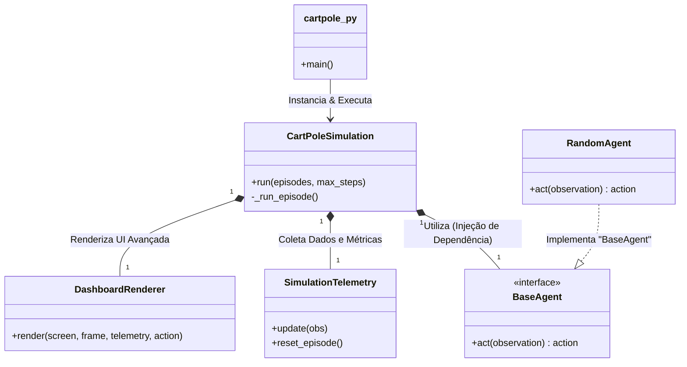

# 🕹️ Level 0: CartPole Experiment (Gymnasium)

Bem-vindo ao primeiro passo da sua jornada em **Reinforcement Learning**. Este repositório contém a implementação base para o ambiente **CartPole-v1**, utilizando a biblioteca modernizada `gymnasium`.

---

## 🎯 Objetivo
O objetivo deste nível é configurar o ambiente de desenvolvimento e executar uma simulação básica do CartPole, onde um agente toma ações aleatórias para tentar equilibrar um mastro sobre um carrinho.

## 📦 Pré-requisitos

### 🐍 Python
- **Recomendado:** Python 3.10 ou 3.11.
- **Aviso:** Evite Python 3.12+ (incompatibilidades conhecidas com `pygame`).

### 🛠️ Bibliotecas
- `gymnasium[classic-control]`
- `pygame` (para renderização gráfica)
- `numpy`

---

## 🚀 Instalação e Configuração

Siga os passos abaixo no seu terminal para preparar o ambiente:

1. **Criar Ambiente Virtual (Recomendado)**
   ```powershell
   python -m venv venv
   ```

2. **Ativar o Ambiente**
   - **Windows:** `.\venv\Scripts\activate`
   - **Linux/macOS:** `source venv/bin/activate`

3. **Instalar Dependências**
   ```powershell
   pip install gymnasium[classic-control] pygame
   ```

---

## ▶️ Como Executar

Para iniciar a simulação, execute o script principal:

```powershell
python cartpole.py
```

---

## 🛠️ Automação (Taskfile)

Se você tiver o [Task](https://taskfile.dev/) instalado, pode usar comandos curtos para gerenciar o projeto:

- **`task setup`**: Cria o ambiente virtual e instala dependências.
- **`task run`**: Executa a simulação padrão.
- **`task run:stable`**: Executa o agente (aleatório) até que ele consiga ficar estável por 5 segundos.
- **`task run:many`**: Executa episódios continuamente até ser interrompido.
- **`task clean`**: Remove o ambiente virtual e arquivos temporários.

---

### 🎮 Controle do Ambiente
O CartPole possui um **Espaço de Ação Discreto**:
- `0`: Empurrar o carrinho para a **esquerda**.
- `1`: Empurrar o carrinho para a **direita**.

> [!NOTE]
> Por padrão, este script executa ações aleatórias. O comportamento parecerá caótico até que um agente de IA real seja implementado.

---

## 📁 Estrutura do Projeto e Arquitetura (SOLID)

O projeto foi refatorado utilizando princípios de **Arquitetura de Software (SOLID)** para separar responsabilidades, tornando o código modular, testável e escalável para a transição para Redes Neurais nos próximos níveis.

### 🧩 Diagrama de Componentes (Como funciona)



### 🤝 Como os blocos conversam entre si:
1. **`cartpole.py`**: É o grande "maestro" configurador. Ele lê a linha de comando (terminal), cria o `RandomAgent` e injeta ele na Simulação.
2. **`CartPoleSimulation` (O Motor Central)**: Coordena o Loop do Motor Físico (Gymnasium).
3. **A cada milissegundo de simulação**:
    - A simulação captura a *Observação* (onde o pêndulo e o carro estão).
    - Entrega a observação para o **Agente** (`agent.act(obs)`) que devolve a *Ação* (empurrar esquerda ou direita).
    - O ambiente reage a ação, e o estado físico resultante é injetado em **`SimulationTelemetry`** para que salve os rastros/estatísticas.
    - O sistema de interface **`DashboardRenderer`** desenha tudo bonitinho na tela, separando a lógica gráfica da física.

### 🗂️ Nova Organização das Pastas

```text
Level_0_CartPole/
├── cartpole.py       # Ponto de entrada (Entrypoint).
├── core/             # O núcleo e regras de negócio da simulação virtual.
│   ├── simulation.py # Orquestrador principal. O loop infinito vive aqui.
│   └── telemetry.py  # O analista de dados. Guarda vel., posiç., temp., etc.
├── agents/           # Os cérebros jogando o jogo (Inteligência).
│   ├── base.py       # Molde de como deve ser um agente.
│   └── random.py     # Agente "bobo" que aperta botões ao acaso.
├── visuals/          # Controle do Frontend/Display Gráfico (O Dashboard).
│   ├── renderer.py   # Lógica do painel dashboard 100% isolado.
│   └── theme.py      # CSS do dashboard (cores, fontes e layout coordenado).
└── README.md         
```

---

## 🛠️ Solução de Problemas

| Erro | Causa Provável | Solução |
| :--- | :--- | :--- |
| `ModuleNotFoundError: gymnasium` | Biblioteca não instalada. | `pip install gymnasium` |
| `No module named pygame` | Falta o motor de renderização. | `pip install pygame` |
| Falha no build do `pygame` | Versão do Python incompatível. | Use Python 3.11. |
| Importações amarelas no VS Code | Interpretador incorreto selecionado. | `Ctrl+Shift+P` -> Python: Select Interpreter. |

---

## 🧠 Próximos Passos
Agora que o ambiente está funcional, você pode avançar para:
- Implementar **Q-Learning**.
- Explorar algoritmos de **Deep RL** (DQN, PPO).
- Criar seu próprio currículo de treinamento.

---
*Desenvolvido como parte do POC de Currículo Gym.*