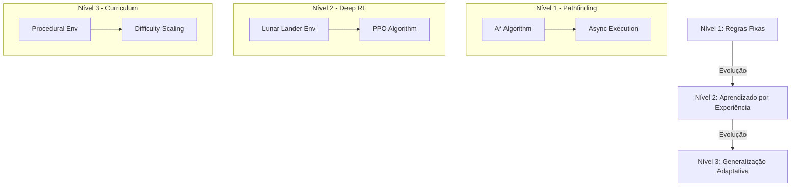

# POC: Trilha de Automação e Reinforcement Learning (RL)

Este repositório é uma Prova de Conceito (POC) projetada para demonstrar a evolução de algoritmos de navegação tradicionais para o aprendizado por reforço profundo (Deep RL) com técnicas avançadas como Curriculum Learning.

---

## 🏗️ Estrutura do Projeto e Arquivos

```text
.
├── level_1_pathfinding/       # Nível 1: Algoritmos Determinísticos & Async
│   ├── grid_env.py            # Ambiente de grade 2D
│   ├── pathfinding.py         # Implementação do algoritmo A*
│   ├── main.py                # Script principal com execução assíncrona
│   └── test_performance.py    # Testes de performance do pathfinding
├── level_2_deep_rl/           # Nível 2: Introdução ao Deep RL
│   ├── models/                # Modelos treinados salvos
│   ├── train.py               # Treinamento do agente PPO no Lunar Lander
│   └── evaluate.py            # Avaliação do agente treinado
├── level_3_curriculum/        # Nível 3: Generalização & Curriculum Learning
│   ├── models/                # Modelos de cada fase do currículo
│   ├── parkour_env.py         # Ambiente customizado de Parkour 1D
│   ├── train_curriculum.py    # Treinamento escalonado por dificuldade
│   ├── verify_generalization.py # Teste de generalização em níveis difíceis
│   └── debug_render.py        # Visualização em modo texto do agente
├── LICENSE
└── README.md                  # Este arquivo
```

---

## 🚀 Como Executar

### 1. Pré-requisitos
Certifique-se de ter o Python 3.10+ instalado.

### 2. Instalação de Dependências
```bash
pip install numpy gymnasium[box2d] stable-baselines3 shimmy torch pygame
```

### 3. Executando os Níveis

#### **Nível 1: Pathfinding Assíncrono**
Navegação em grade usando A* com múltiplos agentes rodando em paralelo via `asyncio`.
```bash
PYTHONPATH=. python3 level_1_pathfinding/main.py
```

#### **Nível 2: Deep RL (Lunar Lander)**
Treine e avalie um agente para pousar uma nave usando PPO.
```bash
# Para treinar (pode levar alguns minutos)
PYTHONPATH=. python3 level_2_deep_rl/train.py

# Para avaliar o modelo salvo
PYTHONPATH=. python3 level_2_deep_rl/evaluate.py
```

#### **Nível 3: Curriculum Learning (Parkour)**
Treinamento evolutivo onde a dificuldade aumenta conforme o agente aprende.
```bash
# Para treinar o currículo completo
PYTHONPATH=. python3 level_3_curriculum/train_curriculum.py

# Para verificar a generalização em níveis difíceis
PYTHONPATH=. python3 level_3_curriculum/verify_generalization.py
```

---

## 📊 Fluxo de Aprendizado (Roadmap)



---

## 🎓 Deep Dive Didático

### 1. Por que Pathfinding Assíncrono?
No **Nível 1**, mostramos que algoritmos tradicionais (A*) são excelentes para problemas conhecidos. O uso de `asyncio` permite que o sistema gerencie múltiplos agentes sem que um espere o outro terminar de processar seu caminho, simulando um ambiente de tempo real.

### 2. O que é PPO (Proximal Policy Optimization)?
Usado nos **Níveis 2 e 3**, o PPO é um algoritmo de Reinforcement Learning que busca um equilíbrio entre a exploração de novas ações e a exploração do que já funcionou, evitando atualizações de política muito drásticas que poderiam "desestabilizar" o aprendizado.

### 3. Curriculum Learning: O "Pulo do Gato"
No **Nível 3**, enfrentamos o problema da "Exploração Esparsa". Se um agente iniciante é jogado em um nível muito difícil, ele nunca chega ao fim e nunca recebe a recompensa de sucesso, logo, nunca aprende.
* **Solução:** Começamos com um ambiente quase sem obstáculos. À medida que o agente domina o básico, aumentamos a dificuldade. Isso cria uma "escada" de conhecimento.

---

### Stack Tecnológica

| Camada | Ferramenta | Descrição |
| :--- | :--- | :--- |
| **Ambiente** | Gymnasium | Interface padrão para ambientes de RL. |
| **Framework RL** | Stable Baselines3 | Implementações confiáveis de algoritmos como PPO. |
| **Processamento** | PyTorch | Engine de redes neurais por trás do treinamento. |
| **Lógica** | Python 3.10+ | Linguagem base para toda a POC. |

---
